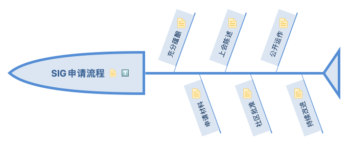

# SIG申请流程

每个 SIG 都能满足一些基本要求
- 小组的主题必须与OpenCloudOS或OpenCloudOS使用场景相关；
- 必须遵照OpenCloudOS 社区的行为准则和治理规范，并且充分反馈到OpenCloudOS社区；
- 原则上，所有关于SIG工作的交流都是公开的；
- 小组内形成的贡献物（包括但不限于代码、文档、视频等）原则上应使用OpenCloudOS社区的开源许可证。如果需要新的许可证，请咨询 SIGCC或TOC成员。
## 1. 充分蕴酿
个人或组织在OpenCloudOS社区中寻找不少于 3个具有共同目标的人讨论决定成立SIG组，维护OpenCloudOS社区中的某一个技术方向软件包或发起孵化项目。
## 2. 申请材料
申请人按照SIG申请模版填写相关内容。
将申请表发邮件到SIGCC（当前由发微信到初创社群周例会暂代）
## 3. 上会陈述
在SIGCC例会（暂由初创社群例会代替）上就技术范围、维护的目标等和与会成员沟通，在 SIG 目标范围、维护及初始工作内容或项目上达成一致。
## 4. 社区批准
SIGCC批准成立本SIG，并向TOC报备。SIGCC为新的SIG设立工作邮箱列表、代码仓。
暂由初创社群例会代替SIGCC行使责任。
## 5. 公开运作
SIG开始通过邮件列表/例行会议等方式开始正式进行沟通运作。
除非特别声明并获得SIGCC首肯，SIG的活动和内容原则上公开透明。
## 6. 持续改进
SIGCC和TOC周期审议各SIG的运作情况，并给出改进指引。
